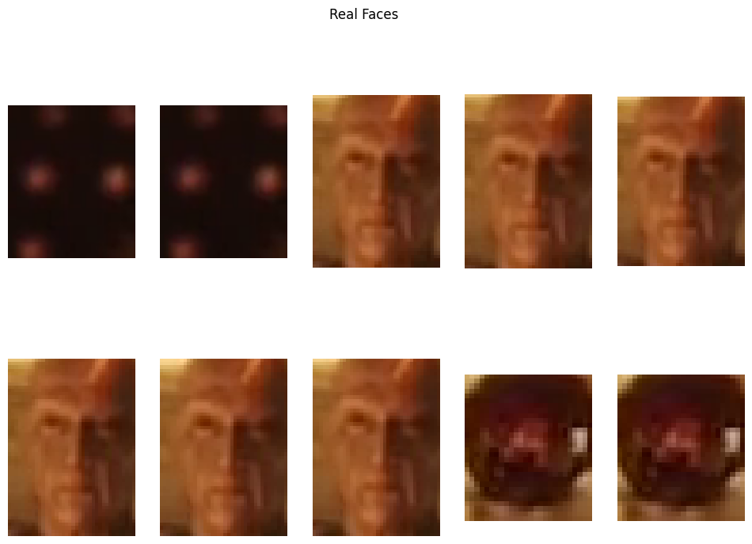

# DeepFake Detection

This project implements a Python-based approach to detect and compare real and fake faces in videos. It leverages MTCNN for face detection, computes similarities using Mean Squared Error (MSE), and visualizes detected faces for analysis.

---

## Features

1. **Frame Extraction**: Extract frames from videos for processing.
2. **Face Detection**: Identify faces in frames using the MTCNN model.
3. **Face Comparison**: Compare faces between real and fake videos using MSE.
4. **Visualization**: Display detected faces for qualitative review.
5. **MSE Analysis**: Calculate average similarity scores for real vs. fake faces.

---

## Prerequisites

1. Python 3.7 or later
2. Required libraries:
   ```bash
   pip install mtcnn opencv-python-headless scikit-image
   ```

---

## File Structure

- **Notebook**: The `.ipynb` file contains the implementation for the entire pipeline.
- **Video Files**: Replace `real_video_path` and `fake_video_path` with the actual paths to your real and fake video files.

---

## Steps to Run

1. Open the `deep_fakedetection.ipynb` notebook in Google Colab or Jupyter Notebook.
2. Mount your Google Drive in Colab (if using Colab):
   ```python
   from google.colab import drive
   drive.mount('/content/gdrive')
   ```
3. Replace the `real_video_path` and `fake_video_path` variables with your video file paths.
4. Run all cells in the notebook to extract faces, calculate similarity, and visualize results.

---

## Core Functions

1. **Frame Extraction**: `extract_frames(video_path, max_frames=100)` extracts frames from a video.
2. **Face Detection**: `detect_faces(frame)` detects faces using MTCNN.
3. **MSE Calculation**: `calculate_mse(imageA, imageB)` computes Mean Squared Error between two images.
4. **Face Extraction**: `extract_faces_from_video(video_path, max_frames=100)` processes a video and returns detected faces.
5. **Face Comparison**: `compare_faces(real_faces, fake_faces)` calculates similarity scores.

---

## Outputs

- The number of faces detected in real and fake videos.
- Average MSE similarity score between real and fake faces.
- Grids of detected faces for visualization.

---

## Example Results

- **Face Count**:
  - Real Video: 30 faces
  - Fake Video: 105 faces
- **Similarity Score**:
  - Average MSE: **5144.94**

output of the example


---

## Visualization

### Real Faces Detected


### Fake Faces Detected
.png)
---

## Limitations

- Performance may vary with video resolution and lighting conditions.
- Requires real and fake video inputs for meaningful comparisons.

---

## Author

Revanth Krishna Sai
